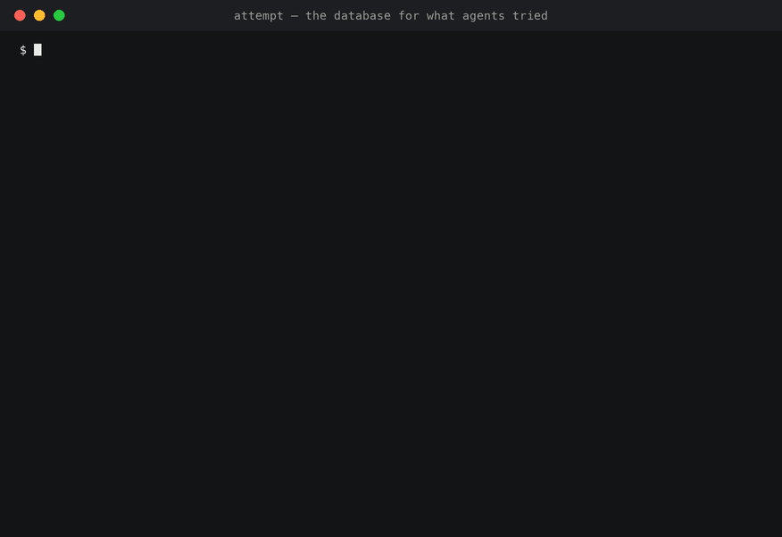

# AttemptDB

**The database for what AI coding agents tried.**

[](https://github.com/nullarch/attemptdb/actions/workflows/ci.yml)
[](LICENSE)
[](Cargo.toml)
[](spec/README.md)

Git records what changed. AttemptDB records what your agents **attempted** —
every prompt, tool call, failed approach, and handoff — in a local, queryable,
temporal and causal database. One binary. No account. Nothing leaves your
machine.

<p align="center">
  
</p>
<p align="center"><sub>Real output, unedited: <code>attempt</code> run against the sanitised public snapshot of this repository's own history. Rendered from the captured text in <a href="docs/media/demo/">docs/media/demo/</a>.</sub></p>

```text
$ attempt timeline
▌ Claude Code  attemptdb  2026-08-28 18:38:17 → open  Minimal coverage  2 turns · 89 tool calls · 7 failures  ses_d0676f26
  12:02:14 turn 1   in progress  (prompt, 9 chars, content not captured)
    att_fd48e022 ✗ failed       [file_not_found] shell ×14 · subagent ×3    8m11s  conf 0.4
    att_0c14c733 ✗ failed       [file_not_found] shell ×12 · read ×2  (2 paths)   8.1s  conf 0.4
    att_79936f8c ✗ failed       [nonzero_exit] shell ×2    888ms  conf 0.4
    att_9226b528 ▶ in progress  shell ×36 · read ×2  (2 paths)         conf 0.4

$ attempt why att_a9c319da
outcome        failed
failure_class  file_not_found
claim          Attempt att_a9c319da (turn 1 #5: shell) failed with `file_not_found`; no later
               attempt retried the same paths. The failing event is ev_01a04b7f-91b6-….
confidence     0.4
uncertainty    Attempt boundaries are Tier 1 heuristics (tier1-v0, confidence 0.4); the failure
               class is the provider's coarse classification and the error text was not inspected.
               Coverage is minimal (no session start, no session end); events may be missing.
evidence       ev_01a04b77-c1ae-…, ev_01a04b7f-9194-…, ev_01a04b7f-91b6-…
```

That is this repository's own history, from the sanitised snapshot that ships
with the repo (ids shortened here). Every answer carries its confidence, its
uncertainty, and the event ids it rests on — and "content not captured" is
printed rather than guessed.

## Install

```sh
curl -fsSL https://raw.githubusercontent.com/nullarch/attemptdb/main/install.sh | sh
attempt init                   # a local database, no signup
attempt hook install           # Claude Code · Codex · Cursor · Gemini CLI, detected and wired
```

Windows PowerShell:

```powershell
irm https://raw.githubusercontent.com/nullarch/attemptdb/main/install.ps1 | iex
```

The installer resolves the latest release, checks the archive against the
published `SHA256SUMS`, and drops `attempt` and `attempt-hook` into
`~/.local/bin` (`ATTEMPTDB_BIN_DIR` to change that). Prebuilt binaries exist
for macOS arm64/x86_64, Linux x86_64/arm64 (gnu and musl) and Windows
x86_64/arm64; [`docs/releasing.md`](docs/releasing.md) says exactly what each
release publishes.

`cargo install attemptdb` will be the other path once the crates are on
crates.io; until then, from source: `git clone`, then `cargo install --path
crates/attempt`. A Homebrew tap is wired into the release workflow but is not
live yet, so `brew install attempt` is not a path.

Then work as usual. `attempt timeline` when you want to know what happened, or
`attempt ui` for the Agent Timeline: a local web interface on an authenticated
loopback port with the current work, the Needs You queue, the work board and
the attempt path. It embeds its own assets, makes no external request, and
needs no account. Nothing captured yet? `attempt ui --demo` opens a bundled,
clearly labelled build history in a separate database. `attempt ui export
card.svg` writes a sanitized 1200×630 summary card for a README or an issue.

## The problem

You asked Claude to fix a flaky test. Forty minutes later the test passes and
the commit shows one clean diff.

What the commit does not show: the agent tried three approaches first, the
second one deleted a fixture it then had to restore, a permission prompt sat
unanswered for eleven minutes, and the fix that finally worked was suggested by
a subagent after the first one gave up. Tomorrow a different agent — or you —
will start from the diff and rediscover all of it.

Coding agents already emit this history through hooks. It just goes nowhere.
AttemptDB catches it, keeps it on your disk, and lets you ask questions of it.

## What you can ask

```sql
SHOW FAILED ATTEMPTS FOR project = 'attemptdb';      -- what didn't work, and why
WHY ses_0191e3a1 STATUS BLOCKED;                     -- evidence-backed, with an uncertainty note
TRACE att_0191e3b0 CAUSES;                           -- walk the causal chain backwards
STATE project AT '2026-08-28T09:00:00Z';             -- what the project looked like at that moment
SHOW HANDOFFS BETWEEN agent = 'claude_code' AND agent = 'codex';
SELECT tool_name, outcome_status, count(*) FROM events GROUP BY 1, 2;   -- plain SQL works too
```

Every `WHY`, `TRACE`, and `STATE` answer cites event ids. "Insufficient
evidence" is a valid answer. An inference is never shown as a fact: attempts,
blockers, and handoffs carry a confidence, the ids they were derived from, and
the version of the algorithm that derived them.

Your agents can ask too. `attempt mcp` exposes the same questions over MCP,
including `attempt_handoff_brief` — a continuation brief for the next session
with evidence ids and an explicit "what I don't know" section.

## Numbers

Measured, not estimated. One machine (Apple M5 Pro), a 1.45 M-event workload
modelled on real distributions, raw JSON in the repo.

| | |
|---|---|
| Hook cost | **124 µs** in-process; wall p50 4.2 ms with the dedicated `attempt-hook` binary (0.8 MB — process spawn is the rest), 6.6 ms through the 76 MB `attempt` — the agent never waits on a database |
| Ingest | **8,592 events/s** with an fsync per batch (11,881 relaxed) |
| Size | **134 B per event** metadata-only; 2.11 KiB with prompts and tool output, 5.3× compressed |
| Causal trace | **187 µs** for `TRACE … CAUSES DEPTH 10` over a 2.08 M-edge graph |
| Durability | 25 crash-injection tests: kill during WAL append, segment flush, manifest publish; torn tails; disk full |
| Tests | 392 across 34 suites; 126 provider fixtures with privacy canaries |

The unflattering numbers are in the same document: a first load of the whole
1.45 M-event history takes about a minute and 21 GiB of memory. A *reload*
after new events is incremental — cached
segments, only the touched sessions re-projected — and 11× faster than a
cold load at 200 k events. [`docs/benchmarks.md`](docs/benchmarks.md).

## Why not …

| | What it records | What it can't tell you |
|---|---|---|
| **Git** | the final state of files | what was tried, what failed, what was undone, who was waiting on whom |
| **OpenTelemetry + a tracing UI** | spans and latencies | that attempt 2 *superseded* attempt 1; what the project looked like at 09:00; a query language for "why" |
| **Agent memory / vector DBs** | extracted preferences and facts | the timeline itself — they store what an LLM concluded, not what happened |
| **A hosted analytics dashboard** | metadata you uploaded | anything you didn't upload — and you shouldn't have to upload your prompts to see your own history |
| **SQLite with a schema** | rows | temporal reconstruction, causal traversal, fact/inference versioning, per-device ordering — AttemptDB owns its engine because these *are* the workload |

AttemptDB is not a replacement for Git, not an LLM tracing skin, not a vector
store, and not a claim that inferred intent is ground truth.

## Your data stays yours

- **Local by default.** The database is a directory on your disk. There is no
  hosted service in this repository and no telemetry.
- **Content is a storage property, not a setting you forget.** Prompts,
  commands, and tool output live in `content`; metadata lives in an
  allowlisted `attrs` map. The engine enforces the allowlist at ingest and
  counts what it drops — a buggy adapter or an old client cannot smuggle text
  into metadata.
- **Encrypted at rest.** Content is stored in XChaCha20-Poly1305 blobs under a
  key you hold (`attempt keys`).
- **Sync is opt-in, and metadata-only even then.** `attempt sync` clamps every
  event to `metadata_only` on your machine before it is serialised.
  `--send-content` is an explicit flag — and even then credentials (issuer-format
  tokens, private keys, JWTs) are redacted on the device first. The server
  enforces its own ceiling regardless of what a client sends.
  `--profile metadata_only|semantic|full` names what leaves; `attempt sync
  add <name> <url>` uploads to a second server under its own profile and
  cursor, and `attempt sync connect vibemon` is the hosted companion's URL.
- **Inferences travel only with their provenance.** `--send-inferences` (off by
  default) uploads attempts, handoffs, work units, and decisions — each with
  the event ids it was derived from, its confidence, and the algorithm
  version. Nothing without evidence leaves; the server stores them beside the
  events, never as events.
- **Per-repository policy.** `attempt sync policy exclude github.com/acme/private`
  and that repository never leaves the machine, not even its metadata; the
  server does not learn it exists.
- **Shareable without leaking.** `attempt snapshot export --sanitized` strips
  prompts, commands, output, raw payloads, and home paths; `attempt snapshot
  audit` shows you what is left before you publish it.
- **Provable.** Privacy canary tests fail the build if payload content reaches
  a metadata field. `attempt conformance` checks any event stream against the
  same rules.

## How it works

```text
Claude Code · Codex · Cursor · Gemini CLI
        │  attempt-hook <provider>   (normalise → append to spool → exit 0; ~ms, never blocks the agent)
        ▼
  spool ──► single writer ──► WAL (fsync, CRC32C) ──► Arrow IPC segments (zstd, dictionary)
            assigns seq + hybrid logical clock            manifests: newest valid generation wins
                                                                 │
        Tier-1 projections: sessions · turns · tool calls · attempts · handoffs · work units · causal edges
                                                                 │
        DataFusion SQL  +  AttemptQL (SHOW / WHY / TRACE / STATE / DIFF)
                                                                 │
        attempt CLI · local web UI · MCP server · .atdb snapshots · sync client
```

- **An owned engine, not SQLite.** A framed write-ahead log with checksummed
  torn-tail recovery, an in-memory table for recent writes, immutable columnar
  segments for history. The byte-level contract is
  [`docs/storage-format.md`](docs/storage-format.md).
- **Apache Arrow + DataFusion** for the in-memory format and SQL execution;
  AttemptDB owns the model, the temporal and causal semantics, and AttemptQL.
- **Facts and inferences never mix.** Events are immutable. Everything derived
  is versioned, carries evidence ids and a confidence, and can be corrected
  (`attempt correct`) or retracted (`attempt retract`) by appending — never by
  rewriting.

## An open format

The canonical event is published: [`spec/event-v1.schema.json`](spec/event-v1.schema.json)
is the JSON Schema of exactly what this implementation writes. CI validates
every fixture against it and round-trips a fully populated event, so the schema
cannot drift from the code.

```text
$ attempt conformance events.jsonl
AttemptDB Event v1 · 4473 event(s) on 4473 line(s)

Envelope            ✓
Identity            ✓
Temporal            ✓
Causality           ✓   104 note(s)
Provenance          ✓   4 note(s)
Extensions          ✓

COMPATIBLE
```

Write an adapter for any agent, run this, and it speaks AttemptDB.
[`spec/README.md`](spec/README.md).

## Status

Pre-release. Formats may still change before the first tag.

**Works today:** capture for four agents with a structural installer and
`attempt doctor`; the storage engine with crash recovery, repair, and
snapshots; Tier-1 projections including work units and corrections; AttemptQL
and SQL; `timeline`, `why`, `trace`, `failures`, `handoffs`; a local web UI
with a static sanitised export; an MCP server; a capture daemon (launchd /
systemd --user); transcript import for history from before the hooks;
encrypted content; the sync client and a reference sync server; the Event v1
schema and conformance suite.

**Not yet:** signed release binaries; the crash and
repair suites on Windows (they run on macOS and Linux); Tier-2 semantic
inference.

[`PROGRESS.md`](PROGRESS.md) is the honest log, including the things CI found
that a laptop could not.

## FAQ

**Does it slow my agent down?** The hook does 124 µs of work and exits; it
never opens the database. If the daemon or the disk is unavailable, events
spool to a file and nothing blocks. The hook always exits 0.

**Is it spyware for managers?** No, and it is designed not to be usable as
one: the database is on the developer's machine, sync is opt-in and
metadata-only, and [`SECURITY.md`](SECURITY.md) lists covert monitoring as an
explicit non-goal — features that would require it are out of scope.

**Why build a storage engine instead of using SQLite?** Because the workload
is the point: per-device ordering, time-travel reconstruction, causal
traversal, and versioned inference over immutable facts. Those are the
engine's primitives, not tables bolted onto a general-purpose database. The
engine is [documented to the byte](docs/storage-format.md) so you can check
that claim.

**Why not OpenTelemetry?** Spans are a fine transport and AttemptDB's fields
map onto the GenAI semantic conventions (RFC 0001 §9). But a trace has no
notion of an attempt superseding another, of a project's state at a point in
time, or of "why". Those need a model, and the model needs a database.

**Which agents?** Claude Code, Codex, Cursor, and Gemini CLI, with fixtures
and golden envelopes for each; the
[compatibility matrix](docs/compatibility-matrix.md) says which events are
verified against real payloads. Anything else can conform to Event v1.

**Is there a hosted version?** [VibeMon](https://vibemon.dev) is the optional
hosted companion for teams, built on the same sync protocol. It is never
required, and this repository works fully without it.

## Documentation

- [Canonical event model](docs/rfcs/0001-canonical-event-model.md) · [Event v1 spec](spec/README.md)
- [Storage engine](docs/rfcs/0002-storage-engine.md) · [On-disk format](docs/storage-format.md)
- [Facts, inferences, and time](docs/rfcs/0003-fact-inference-bitemporal-model.md)
- [AttemptQL](docs/rfcs/0004-attemptql.md)
- [Cross-platform runtime](docs/rfcs/0005-cross-platform-runtime.md)
- [Privacy and sync](docs/rfcs/0006-privacy-and-sync.md)
- [Benchmarks](docs/benchmarks.md) · [Releasing](docs/releasing.md) · [Deploying the sync server](docs/deploy.md) · [Security](SECURITY.md)

## Contributing

[CONTRIBUTING.md](CONTRIBUTING.md) covers the setup, the adapter contract, the
fixture and privacy rules, and the RFC process. Issues labelled
[`good first issue`](https://github.com/nullarch/attemptdb/labels/good%20first%20issue)
are scoped so that the first pull request is a small one: shell completions, a
man page, adapter fixtures, the architecture diagrams. Adding support for
another coding agent is one adapter plus its fixtures.

Questions and design ideas belong in
[Discussions](https://github.com/nullarch/attemptdb/discussions);
vulnerabilities and capture leaks go through
[private reporting](https://github.com/nullarch/attemptdb/security), never a
public issue.

Apache-2.0.
