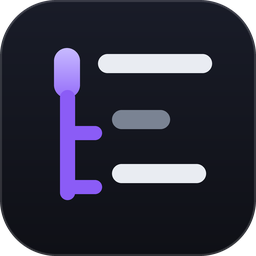
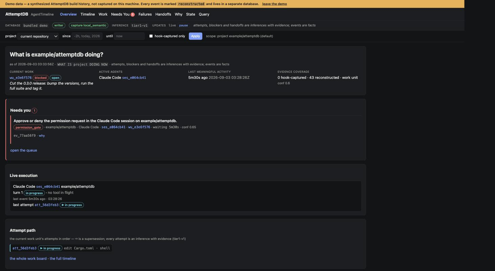

# AttemptDB

**The database for what AI coding agents tried.**

[](https://github.com/nullarch/attemptdb/actions/workflows/ci.yml)
[](https://github.com/nullarch/attemptdb/releases/latest)
[](LICENSE)

**Git records the diff. Keep the attempts behind it.**

The test passes. The diff is clean. But which approaches failed first, what
finally worked, and where did the next agent pick up?

AttemptDB captures coding-agent activity on your machine and turns it into a
queryable history of attempts, retries, and handoffs. Revisit a failed approach,
find work waiting on you, or give your next agent the history behind the code.

**Claude Code · Codex · Cursor · Gemini CLI**<br>
Local database. Built-in web UI. SQL and MCP. No account or API key required.

[Try the demo](#try-it) · [Query your history](#ask-your-history) · [Connect your agent](#give-your-next-agent-the-history) · [Share a timeline](#share-the-story-behind-the-fix)

<p align="center">
  <a href="docs/media/ui-demo.gif">
    
  </a>
</p>
<p align="center"><sub>
  <a href="docs/media/ui-demo.gif">Watch the 25-second walkthrough</a> · Reproduce it with <code>attempt ui --demo</code>.<br>
  Real UI, synthetic data: a labelled reconstruction of AttemptDB's storage-engine work.
</sub></p>

## Try it

**macOS / Linux** — one line. It installs the binary and runs `attempt setup`:
your local database, hook entries in every coding agent on the machine
(Claude Code, Codex, Cursor, Gemini CLI — next to whatever is already there),
the background daemon, and a check. The next agent session is captured.

```sh
curl -fsSL https://raw.githubusercontent.com/nullarch/attemptdb/main/install.sh | sh
```

**macOS app** — the same setup with a window, and the Agent Timeline in a
window of its own instead of a browser tab. Download the disk image from the
[latest release](https://github.com/nullarch/attemptdb/releases/latest)
(`AttemptDB-<version>-aarch64-apple-darwin.dmg` for Apple silicon,
`…-x86_64-apple-darwin.dmg` for Intel), drag AttemptDB to Applications,
launch it, press **Set up this machine**. It puts the very same `attempt`
binary in `~/.local/bin` and stays in the menu bar with one line: open
sessions, and what needs you.

<details>
<summary>The image is not signed yet — the first launch</summary>

Without an Apple Developer signature, macOS refuses the first launch with
"Apple could not verify AttemptDB". Open **System Settings → Privacy &
Security**, scroll to the message about AttemptDB, press **Open Anyway**,
and launch it again. This happens once. Everything the app then installs is
the checksummed release binary, and the app does nothing the one-line
install does not.

</details>

<details>
<summary><strong>Windows PowerShell</strong></summary>

```powershell
irm https://raw.githubusercontent.com/nullarch/attemptdb/main/install.ps1 | iex
```

</details>

Run either installer again any time: it upgrades the binary and repairs the
wiring, and nothing is created twice. `ATTEMPTDB_NO_SETUP=1` installs the
binary only; `attempt setup --dry-run` shows what setup would change;
`attempt uninstall` removes the hooks and the service and keeps your history.

To look before you wire anything:

```sh
attempt ui --demo
```

The demo opens in your browser with a failed attempt, a successful retry, a
cross-agent handoff, and a permission request waiting for you. Follow
**Needs You → why** for the evidence, or **Work** for the attempt chain.
It uses a separate demo database. Press **Ctrl+C** in the terminal when
you're done.

The installer verifies the release's SHA-256 checksums and installs `attempt`
plus the small `attempt-hook` capture executable into `~/.local/bin` (add it
to your shell's `PATH` for future terminals; hooks use the absolute path). See
[release downloads](https://github.com/nullarch/attemptdb/releases/latest)
for available macOS, Linux, and Windows builds.

<details>
<summary>Build from source (Rust 1.94+)</summary>

```sh
git clone https://github.com/nullarch/attemptdb.git
cd attemptdb
cargo install --path crates/attempt
cargo install --path crates/attempt-hook
attempt ui --demo
```

The first build takes a while: it includes Arrow and DataFusion.
Ensure Cargo's bin directory is on your `PATH`.

</details>

## Capture your own work

The installer and the app already ran this; from a source build, or after
`ATTEMPTDB_NO_SETUP=1`, it is one command:

```sh
attempt setup            # database, agent hooks, background daemon, check
attempt doctor           # later: is every agent configured and active?
```

Setup detects your agents, backs up their configuration, adds its hook
entries next to whatever is there, sends one test event through the real
pipeline per agent, and lists what only you can finish (Codex asks you to
trust new hooks from `/hooks`). It is safe to repeat. The same steps exist
on their own — `attempt init`, `attempt hook install`, `attempt daemon
install` — for a machine you wire by hand.

New installs capture prompts and tool output locally by default. For a
content-free history, run `attempt setup --capture-mode metadata_only`
before the first session (an existing database keeps its mode). In that
mode, missing text is intentional.

After some work, open the timeline:

```sh
attempt ui          # Current work, Needs You, attempts, and evidence
attempt timeline    # The history in your terminal
```

Capture coverage depends on the agent and the events it exposes. The UI shows
coverage and uncertainty alongside inferred work; `attempt doctor` helps
diagnose missing capture.

## Ask your history

| When you need to know… | Start here |
|---|---|
| What already failed? | Failed attempts and the retries that superseded them |
| Is anything waiting on me? | **Needs You**, with the signal and evidence behind each item |
| Where did another agent pick up? | Handoffs, shared paths, and the time between sessions |
| What was happening before the fix? | Project state at a point in time |

Run these against your captured history:

```sh
attempt query "SHOW FAILED ATTEMPTS"
attempt query "SHOW SUPERSEDED ATTEMPTS"
attempt query "SHOW HANDOFFS"
attempt query "STATE project AT '-1h'"
```

Replace `ATTEMPT_ID` with an ID from the timeline to inspect its explanation
and causal path:

```sh
attempt why ATTEMPT_ID
attempt trace ATTEMPT_ID
```

Plain SQL works too. For example, list recent attempts with the tool-call
counts already computed by the projection:

```sh
attempt query "SELECT attempt_id, outcome, failure_class, tool_call_count, confidence
FROM attempts
WHERE retracted = false
ORDER BY started_at DESC
LIMIT 10"
```

**Events are facts. Attempts, blockers, and handoffs are inferences.** Each
inference carries evidence IDs, confidence, and an algorithm version. `WHY`
explains its uncertainty; insufficient evidence is a valid answer. A failed
attempt replaced by a retry is labelled `superseded`, so it has its own query.

`attempt schema` teaches you the tables and their rules; `attempt schema attempts`
describes every column above. `attempt schema --examples` prints worked
questions. The [full catalog](docs/query-context.md) comes from the same source.
Queries are read-only; plain SQL must explicitly exclude retracted rows.

## Give your next agent the history

AttemptDB includes an MCP server. Print the setup instructions for your client:

```sh
attempt mcp --print-config
```

After connecting it, try asking:

> Use AttemptDB to review this project's previous attempts before changing the
> code. What failed, what superseded it, and what is still unresolved? Cite the
> evidence and say what you don't know.

The agent can discover the catalog with `attempt_schema`, query it with
`attempt_query`, and request a continuation brief with `attempt_handoff_brief`.
The brief includes evidence and an explicit account of what is unknown.

## Share the story behind the fix

Export a summary card for your README or a browsable timeline for an issue:

```sh
attempt ui export card.svg
attempt ui export timeline.html --sanitized
```

The SVG carries outcomes, failure classes, counts, and repository-relative
paths. The sanitized HTML strips prompts, commands, tool output, raw payloads,
and absolute paths. Review what remains before sharing: repository names and
relative paths can still matter. Both include a removable AttemptDB attribution
(`--no-attribution`).

## Your data, on your machine

- **Local by default.** Capture, queries, UI, and MCP work without an account
  or hosted service. There is no usage telemetry. The UI serves its own assets
  on an authenticated loopback address. Setup also points Claude Code's and
  Codex's OpenTelemetry exporters at your local daemon; no third-party
  collector is involved. See [local telemetry](docs/otel.md).
- **You choose the content.** `local_semantic` keeps content locally;
  `metadata_only` strips it. An allowlist separates metadata from content,
  enforced at ingest and checked by privacy canary tests.
- **Check encryption explicitly.** `attempt init` attempts to enable encrypted
  content blobs with a local key. Run `attempt keys status` to check the result
  and see any older, unencrypted segments. This is content-blob encryption,
  not whole-disk encryption.
- **Sync is opt-in.** Metadata profiles omit prompt and tool-output text;
  sending content requires an explicit opt-in, and the `messages` profile
  sends only the conversation — your prompts and the agent's replies,
  secret-redacted — while commands and tool output stay local. A reference
  sync server is included. [VibeMon](https://vibemon.dev) is the optional
  hosted companion.
- **Updates contact GitHub.** Background maintenance checks release policy
  daily and can install updates automatically. Set `"auto_update": "off"` in
  `config.json`, or `ATTEMPTDB_NO_AUTO_UPDATE=1`, to disable automatic updates.

See the [privacy and sync contract](docs/rfcs/0006-privacy-and-sync.md) and
[security policy](SECURITY.md) for the boundaries.

<details>
<summary>Update or uninstall</summary>

```sh
attempt update --check    # Check the published release policy
attempt update           # Update now; health-checked, with rollback on failure
attempt uninstall        # Remove hooks and background service; keep your history
```

With background maintenance installed, required updates run promptly and
optional updates run at a quiet moment. `"auto_update": "required"` installs
only required updates. Manual updates remain available when automation is off.

</details>

## Under the hood

```text
Claude Code · Codex · Cursor · Gemini CLI
                    │ hooks
                    ▼
              local spool → single writer → WAL → Arrow IPC segments
                                                      │
                                    inferred attempts, work units, causal edges
                                                      │
                                         DataFusion SQL + AttemptQL
                                                      │
                                           CLI · web UI · MCP
```

Written in Rust. AttemptDB owns its storage engine: a checksummed write-ahead
log, crash recovery, immutable Arrow segments, and portable `.atdb` snapshots.
**No SQLite in the core.** Arrow and DataFusion provide the columnar format
and SQL execution; AttemptDB provides the temporal and causal model.

The hook never opens the database; the writer handles durable storage.
The published benchmark measured **124 µs p50 of in-process hook work** on macOS
ARM64; process startup adds milliseconds. The [benchmark report](docs/benchmarks.md)
includes the workload, raw results, memory costs, and slow paths. Those are
dated measurements; [later read-path measurements](PROGRESS.md#2026-09-02--engine-audit-the-read-path-was-the-scaling-ceiling-and-it-was-rebuilt)
track subsequent changes.

Events are immutable. Corrections and retractions append history. The
[on-disk format](docs/storage-format.md) and [Event v1 schema](spec/README.md)
are public; `attempt conformance events.jsonl` validates another producer's
events against the contract.

## Status and contributing

**Early 0.2 releases are available.** Local capture for four agents, the UI,
MCP, SQL/AttemptQL, snapshots, corrections, transcript import, and opt-in sync
are implemented. Current inference uses deterministic rules; semantic
inference is planned. Release binaries are not code-signed yet, and the
Unix crash/repair suites still need Windows equivalents.

Want another agent supported? Start with an adapter and sanitized fixtures.
Found a misleading inference? A small, sanitized reproduction helps improve
the rules. [CONTRIBUTING.md](CONTRIBUTING.md) covers development and the adapter
contract; [AGENTS.md](AGENTS.md) covers work by coding agents.

[Open an issue](https://github.com/nullarch/attemptdb/issues) ·
[Discuss an idea](https://github.com/nullarch/attemptdb/discussions) ·
[Report a vulnerability privately](https://github.com/nullarch/attemptdb/security)

[Documentation](docs/README.md) · [Query catalog](docs/query-context.md) ·
[Architecture RFCs](docs/rfcs/) · [Progress log](PROGRESS.md) ·
[Roadmap](TODO.md) · [Apache-2.0](LICENSE)
