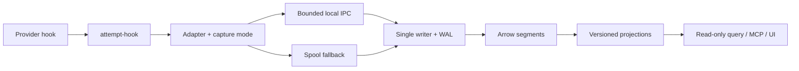

# Hook architecture audit — 2026-09-06

AttemptDB's core boundary is appropriate: providers emit observations to a
small local command; adapters normalize them, the capture mode strips content
before transport, IPC hands them to the single writer, and a spool survives
daemon unavailability. The WAL owns durability. Projections remain versioned
inferences, and query/MCP/UI consume those projections. Hosted sync is optional
and outside the hook path.

The audit found defects at the provider and diagnostic boundaries, rather
than a need to replace the storage architecture.

## Changes implemented

| Finding | Correction |
|---|---|
| The installer subscribed a silent observer to Claude `WorktreeCreate`, which replaces native worktree creation | Remove this subscription during upgrade, preserving other people's hooks; keep historical payloads readable |
| Installer lists could drift from adapters | Adapters own `capture_events()` separately from readable `supported_events()`; installer and doctor share that contract |
| Cursor only captured specialized edit/shell completions | Install generic start/result/failure hooks, pair by call id, retain generation ids, decode JSON-stringified output and exit codes; remove overlapping specialized subscriptions |
| Cursor lifecycle events may omit `cwd` | Use `workspace_roots` before the process-directory fallback to locate the project database |
| Missing lifecycle signals | Capture Claude instruction loads, teammate idle, added directories and elicitation request/results; Codex compaction and interruption; Cursor subagents and compaction; Gemini permission notifications and compression |
| Gemini treated `error: false` as failure | Separate absent/false/empty error from actual failure; respect explicit nonzero exit codes |
| Any observation cleared an input wait | Background notifications, compaction and config changes no longer imply a human reply; `tier1-v2` invalidates older projected caches |
| A held spool lock could block an agent indefinitely | Nonblocking lock attempt, then atomic publication of a private spool file using the existing ATSP format |
| Payload errors disappeared at metadata sanitization | Record durable `capture_gap` metadata, distinguish oversized input, and retain unsupported-provider observations |
| Any historical event made doctor say active | Require real capture within seven days, exclude reconstructed imports and self-tests, compare maximum capture timestamps in UTC; report disabled hooks explicitly |

Adapter semantics are stamped `0.1.1`. Content such as elicitation answers and
compaction summaries remains content, and is absent under `metadata_only`.
Instructions and lifecycle observations are notifications, not extra prompts
or fabricated tool executions. No event kind or binary storage layout changed.

## Official interfaces reviewed

- [Claude Code hooks reference](https://code.claude.com/docs/en/hooks):
  WorktreeCreate is a behavioral override, FileChanged requires chosen watch
  paths, and lifecycle hooks have different output semantics. Passive capture
  emits no decision or injected context. New `PreModelSwitch`/`PostModelSwitch`
  require 2.1.251; the pre-switch timeout can block a switch. They are **not
  installed** by this change.
- [Codex hooks reference](https://learn.chatgpt.com/docs/hooks): compaction and
  Interrupt are supported; Interrupt has a three-second maximum. Hook review
  is tied to definitions, and hosted tools such as web search bypass the local
  tool hook path. Adding a fictitious PostToolUseFailure subscription would
  not close that coverage gap.
- [Cursor hooks reference](https://cursor.com/docs/hooks): generic tool hooks
  expose stable call ids and JSON-stringified results. Specialized callbacks
  can describe the same operation, so installing both would inflate counts.
- [Gemini CLI hooks reference](https://geminicli.com/docs/hooks/reference/):
  Notification exposes permission alerts and PreCompress exposes compression.
  AfterModel can fire for every streaming chunk; it is not enabled as a cheap
  completion counter.

## Product additions worth pursuing next

1. **Version-aware capabilities and coverage.** Establish tested provider
   minimum versions and run actual host-driven smoke captures, including
   desktop/CLI and multiple config layers. Current unit fixtures are not
   proof of live emission. Use this capability policy before automatically
   adding PostModelSwitch to explain model changes around retries/failures.
2. **Instruction and compaction history in handoffs.** The new observations
   can explain which instructions loaded and when context was compressed.
   Surface their evidence in a continuation brief; do not infer that loading
   an instruction means following it.
3. **Independent concurrent input waits and subagent ownership.** Current
   projections keep one pending signal per session. Correlating elicitation
   ids and agent ids would avoid a sibling's activity or another result
   clearing an unrelated wait. This needs an inference-rule design and tests.
4. **Measured capture gaps and recovery.** Codex hosted tools, host crashes,
   disabled hooks and lost pre-install history remain incomplete coverage.
   Add provider-supported replay/import where available, labelled reconstructed
   and deduplicated against captured history. Do not scrape private transcripts
   by default or describe these sources as equivalent to live hooks.

## Validation and rollout boundary

`cargo test --workspace` passed **623 tests**, with no failures or ignored
tests. `cargo clippy --workspace --all-targets`, `cargo fmt --all --check`,
and `git diff --check` passed. The release hook executable built successfully
(894,912 bytes on macOS arm64).

Regression tests cover subscriptions, safe upgrades, privacy, Cursor pairing,
Gemini failure cases, input waits, real activity versus imports, disabled
settings, payload gaps and lock contention. Existing goldens are regenerated
for the adapter version and Cursor turn identity. Review of all 68 changed
JSON goldens found only adapter-version stamps (109 events) and four Cursor
turn ids. The query catalog is regenerated from Rust for the projection
version. An isolated CLI smoke replay sent 20 synthetic hook events across
all four providers, produced four paired tool calls, retained no content in
metadata-only mode, and honored exit/stdout contracts. Installation was
previewed against the active config paths using `--dry-run`; Codex trust
state and all live hook configurations were left unchanged.

One warm 40-sample release measurement (process spawn included, spool sync
off) gave wall p95 8.18 ms on the shared inbox and 28.03 ms with the inbox
lock held. A stage-timing follow-up during filesystem stress also exceeded
10 ms. Lock contention no longer waits for the owner to release the lock;
these samples do not establish an all-load latency guarantee.

Live inspection confirmed recent Claude and Codex captures on the development
machine. Claude's active account uses a nondefault `CLAUDE_CONFIG_DIR`; checking
only the default directory does not describe that account. Cursor/Gemini's
historical events were not evidence of recent capture. No new live Cursor or
Gemini host run is claimed. This audit does not claim a hard end-to-end hook
deadline: stdin and filesystem stalls still need a separate portable design.

After installing a build containing these changes, run `attempt hook install`
in the intended provider-config environment, then inspect `attempt doctor`.
Codex requires `/hooks` review for new/changed subscriptions; AttemptDB never
writes `[hooks.state]`. Restart Cursor/Gemini sessions to reload their configs.
